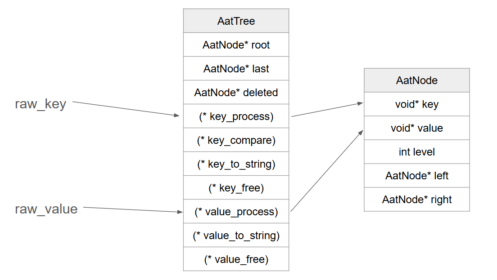
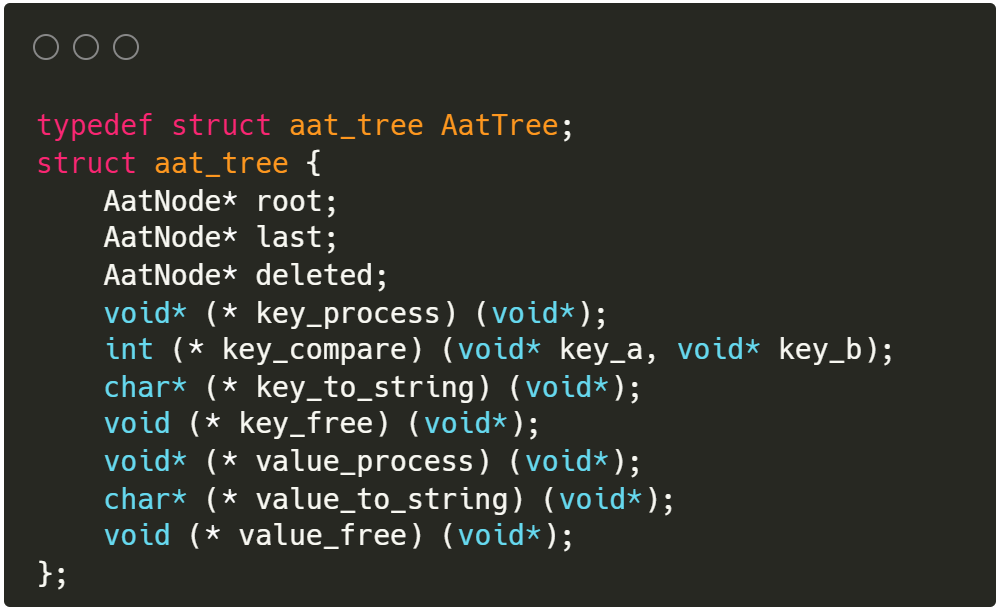
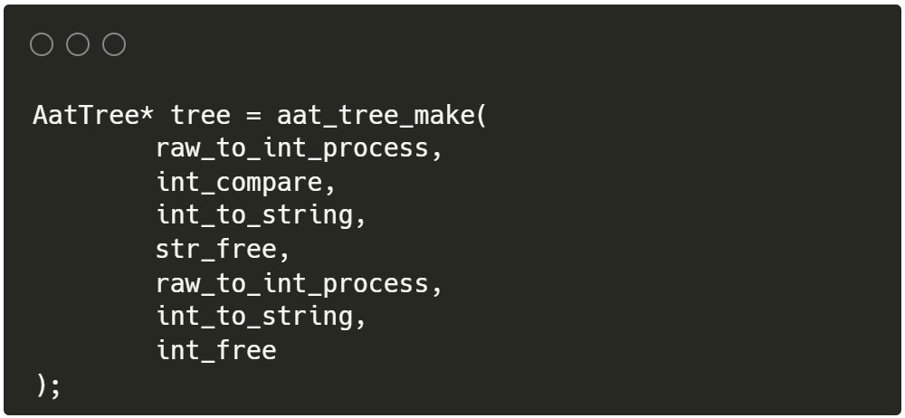

# AATree Implementation in C

AATree with generic type behavior and iterator, implemented in C
AATree is a type of balanced binary tree. For more information about AATree, check out this paper: [Balanced Search Tree Made Simple by Arne Andersson](https://user.it.uu.se/~arneande/abs/simp.html).

# Generic Type Behavior


Generic type behavior is achieved by including function pointers in the tree struct. By setting key and value to type void*, their type behavior are entirely handled by user defined methods, such as initialize, free, to string, and compare.



These methods are only passed in at tree creation. The idea is that all nodes in a single tree should have the same key and value types, and type handling methods are called by the tree upon nodes when needed. Doing so dramatically reduce the memory needed to save function pointers in each node struct.



For demonstration, type behavior methods to support int and char* are already included in aat.c. For an example of initializing an AATree, look at how aat_tree_make() is used in main-aat.c.

# Iterable Behavior
Inspired by the Iterable class in Java, an iterator struct is included to achieve in order traversal of an AATree. When initialized, the struct will keep track of the tree instance it is traversing. A stack is used to keep track of current step in the traversal, and is_end will be updated to true when iterator is done. Caller can use aat_iterator_next() to get the next node, and aat_iterator_has_next() for whether iterator is done.

Because a shallow copy of AATree is used, insertion and deletion in the tree during an iterator's lifecycle will cause problems in the iterator (uncounted nodes for insertion, segmentation fault for deletion).

# Custom String Buffer
As you might wonder while look at aat-main.c, a custom string buffer called StrBuffer is made to assist printing to stdout in this project.

The motivation of such custom buffer is to make in order traversal print of AATree easy.

# Demo
Run `make` in terminal to see the implementation correctly insert large number of keys, and removing some keys based on certain rules.

# Usage
Add aat.c/.h, stack.c/.h, strbuffer.c/.h to any project that needs a balanced binary tree and use! Remember to check .h files for what needs free(), and use the custom free methods where included. Then, user needs to define their own types for keys and values.

This implementation of AATree can support any user defined key and values types. To do so, user have to create the following type behavior methods: raw_to_type(), free(), to_string() for both key and value, and an extra compare() for key. Keep in mind that raw_to_type() is suppose to create a new heap allocated copy of whatever value passed in, and thus a corresponding free() is required. For example of how to handle type behavior methods, check out the section under `// for function pointers` in aat.c.

For an example of how the implementation is used, checked out my [multithreaded-wordmap](https://github.com/chongdayou/multithreaded-wordmap) repo.

# Additional Info
## Reference
[Balanced Search Tree Made Simple](https://user.it.uu.se/~arneande/abs/simp.html) by Arne Andersson

```C
#include<stdio.h>
#include<stdlib.h>
int main(int argc, char* argv[]){
	printf("Hello, world!\n");
	return EXIT_SUCCESS;
}
```